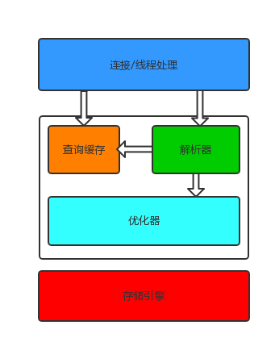

# 1. Mysql架构与历史

Mysql有点与众不同，它的架构可以在多种`不同的场景`中灵活应用，同时也带来选择的困难。 Mysql不够完美，但足够灵活，能适用各种应用类型。

为了充分发挥Mysql的性能并顺利使用，必须理解它的设计。它最重要、最与众不同的特征是它的`存储引擎架构`，这种架构设计将查询处理及其他系统任务和数据的存储/提取相分离。这种`处理和存储分离`的设计可以在使用时根据性能、特征及其他需求来选择数据存储方式。

## 1.1 Mysql逻辑架构



- 第一层： 非独有，连接处理、授权认证、安全等
- 第二层： 核心服务功能：包括查询解析、分析、优化、缓存及内置函数（如：日期时间、数学、加密等），所有跨存储引擎的功能都在这里：存储过程、触发器、视图等
- 第三层： 包含存储引擎，负载Mysql中数据的存储和提取。像文件系统一样，每种存储引擎都各有优势劣势。服务器通过接口与存储引擎通信，这些接口屏蔽了不同存储引擎之间的差异，对上层查询过程透明。存储引擎API包含几十个底层函数，用于执行诸如“开始一个事务“或者”根据主键提取一条记录“等操作。它不会去解析SQL，也不会跨存储引擎通信，只是简单响应上层服务器的请求。

### 1.1.1 连接管理与安全性

每个客户端连接都在服务器进程中拥有一个线程，这个连接的查询只会在这个独立的线程中执行。该线程只能轮流在某CPU核心或CPU中运行。服务器会负责缓存线程，因此不需要为每一个新建的连接创建和销毁线程。

当客户端连接到Mysql服务器时，服务器需要对它进行认证。认证基于用户名、原始主机信息、密码。如果使用安全套接字SSL方式连接的，还可以使用X.509证书认真。一旦连接成功，服务器会继续验证客户段是否具有执行某特定查询的权限。

### 1.1.2 优化和执行

- Mysql会解析查询，并创建内部数据结构（解析树）并对其进行各种优化。包括重写查询、决定表的读取顺序及选择合适的索引等。
- 用户可以通过特殊的关键字提示优化器来影响决策，也可以请求优化器解释优化过程各个因素，来了解优化决策，并提供一个参考基准，便于用户重构查询、修改配置等，以便应用尽可能高效运行。
- 优化器不关心表使用的是什么存储引擎，但存储引擎对优化查询是有影响的。因为优化器会请求存储引擎提供容量或某个操作开销信息以及表的统计信息等。
- 对于SELECT语句，解析前会检查查询缓存，如果能找到相应的查询，服务器就不必再解析、优化、执行查询，而是直接返回查询缓存中的结果集。

## 1.2 并发控制

无论何时，只要有多个查询需要在同一个时刻修改数据，都会产生并发控制的问题。（简单的加锁仅仅能保证正常工作，并不支持并发处理）

这里只讨论Mysql两个层面的并发控制： 服务器层和存储引擎层。

### 1.2.1 读写锁

同一时刻多个用户并发读取没什么问题，因为读取不会修改数据，不会出错。但是，当一个用户读取表的同时，另一个用户试图删除其中某一笔记录，会产生什么结果？结论是不确定的，读的用户可能会报错，也可能读取到不一致的数据。

解决办法就是并发控制： 通过实现一个两种类型的锁组成的`锁系统`来解决。这两种锁通常称为”共享锁 share lock“和”排它锁 exclusive lock“，也叫”读锁 read lock“和”写锁 write lock“。

锁的概念：读锁是共享的（相互不阻塞），多个用户同时刻读取同一资源相互不干扰；写锁是排它的，会阻塞其他写锁和读锁。只有这样，才能确保在给定时间，只有一个用户执行写入，并防止其他用户读取正在写入的同一资源。

### 1.2.2 锁粒度

一种提升共享资源并发性的方式是让锁定对象更有选择性：尽量只锁定需要修改的部分数据，而不是全部数据。 更理想点，之对要修改的数据片精确锁定。在给定资源上，锁定的数据量越小，则系统的并发程度越高。

问题是加锁也需要消耗资源。获得锁、检查锁是否解除、释放锁等都会增加系统开销。如果系统花费大量时间管理锁，而不是存储数据，对性能是大有影响的。

故，所谓的`锁策略`，就是在锁的开销和数据的安全性之间寻求平衡，这种平衡也会影响到性能。 大部分商业数据库没有更多选择，一般都是在表上施加行级锁。而Mysql提供多种选择。不同存储引擎都可以实现自己的锁策略和锁粒度。

表锁：是Mysql最基本的锁策略，而且是开销最小的策略。它会锁定整张表。一个用户对表进行写操作需要先获得写锁，这样会阻塞其他用户对该表的所有读写操作。只有没有读锁时，其他读取的用户才能获得读锁，读锁之间是不互相阻塞的。特定场景中，写锁比读锁有更高的优先级。

行级锁：可以最大程度的支持并发处理，同时也带来了最大的锁开销。在InnoDB和XtraDB及其他存储引擎中实现了行级锁。行级锁只在存储引擎层实现，而Mysql服务器层并没有实现。

## 1.3 事务

经典例子：用户Jane要从支票帐户转移200美元给她的储蓄账户，需要至少3个步骤：
1. 检查支票账户的余额高于200美元；
2. 从支票账户余额中减去200美元；
3. 在储蓄账户余额中增加200美元；

以上三个步骤的操作必须打包在一个事务中，任何一个步骤失败，则必须回滚所有的步骤。

事务的`ACID`特征：
- 原子性：整个事务中的所有操作要么全部提交成功，要么全部失败回滚
- 一致性：数据库总是一个一致性的状态转换到另一个一致性的状态。
- 隔离性：通常说（视隔离级别），事务所做的修改在最终提交之前，对其他事务是不可见的。
- 持久性：一旦事务提交，所做的修改就永久保存下来。（没有100%持久性保证，否则干嘛要备份呢？）

### 1.3.1 隔离级别

SQL标准定义四个隔离级别，规定了一个事务中所做的修改，哪些在事务内和事务间是可见的，哪些是不可见的。低级别的隔离通常执行更高的并发，系统的开销也更低。

- `未提交读`： 事务中的修改即使未提交，对其他事务也是可见的。（问题多多，实际很少用）
  - `脏读`：事务读取到未提交的数据。
- `提交读`： 事务从一开始直到提交，所做的修改对其他事务都不可见。换言之，一个事务开始时，只可见已经提交的事务所做的修改。（Mysql外，大多数据库默认隔离级别）
  - `不可重复读`：同一事务内多次读取同样记录，结果可能一样。
- `可重复读`：保证同一事务中多次读取同样记录的结果是一致的（解决了不可重复读）。（Mysql默认隔离级别； InnoDB和XtraDB存储引擎通过多版本并发控制还解决了幻读的问题）
  - `幻读`： 当某事务读取某范围记录的同时，另一事务在该范围插入了新的记录，当之前的事务再次读取该范围时，会产生幻行。
- `可串行化`：强制事务串行执行。（除非非常需要确保数据一致性而且可以接受没有并发，很少使用）
  - `加锁读`： 在读取的每一行都加锁，可能导致大量的超时和锁争用问题。

|隔离级别|脏读可能性|不可重复读可能性|幻读可能性|加锁读|
|-|-|-|-|-|
|READ UNCOMMITTED|Yes|Yes|Yes|No|
|READ COMMITTED|No|Yes|Yes|No|
|REPEATABLE READ|No|No|Yes|No|
|SERIALIZABLE|No|No|No|Yes|

### 1.3.2 死锁

`死锁`指两个或多个事务在同一资源上互相占用，并请求锁定对方占用的资源，从而导致恶性循环的现象。

多个事务同时锁定同一资源时，或者多个事务试图以不同的顺序锁定资源时，都有可能产生死锁。

为解决此类问题，数据库系统一般实现了各种`死锁检查（锁循环依赖）`和`死锁超时（放弃锁请求）`机制。 死锁发生后，只有部分或完全回滚其中一个事务，才能打破死锁。InnoDB目前`处理死锁`的办法是：将持有最小行级排它锁的事务回滚。

锁的行为和顺序和存储引擎相关的。有些死锁因为数据冲突在所难免，有些死锁和存储引擎的实现方式相关。

### 1.3.3 事务日志

大部分存储引擎都是这样实现的，修改表数据时只需要修改其内存拷贝，再把该修改行为记录到持久在硬盘的事务日志中，进而在后台再慢慢把修改的数据持久化。（两次写磁盘。因为持久日志是追加方式，是磁盘上小区域范围的顺序I/O行为，因此相对较快。）

如果数据修改已经记录到事务日志并持久化，但数据本身还没有写回硬盘，此时系统崩溃，存储引擎在重启时能够自动恢复这部分修改的数据。

### 1.3.4 Mysql中的事务

Mysql能够提供事务支持的存储引擎有： InnoDB和NDB Cluster。第三方有：XtraDB和PBXT。

- Mysql默认是`”自动提交“`模式
  - 除事务外，每个查询都被当作一个事务执行提交操作
  - 在当前连接中，可以通过设置 AUTOCOMMIT 变量禁止或启用
    - 禁止自动提交后，所有查询都在同一个事务中，除非显示执行COMMIT或ROLLBACK。事务结束同时有开始了另一个事务
      - 调整 AUTOCOMMIT 对于非事务的表（MyISAM或者内存表），没有任何影响 （相当于一直处于AUTOCOMMIT开启状态）
      - 一些会导致大量数据改变的特殊命令（如：ALTER TABLE， LOCK TABLE），执行前会强制执行COMMIT提交当前事务
  - Mysql允许执行 SET TRANSACTION ISOLATION LEVEL 设置事务隔离级别
- Mysql服务器层不管理事务，实现事务的是存储引擎。因此，同一事务中，使用多种存储引擎是不可靠的。
  - 事务中混合了事务性和非事务性的表（如：InnoDB和MyISAM表混合），如果需要回滚，会导致非事务性的表无法撤销。（看来，为每张表选择合适的存储引擎非常重要）
- InnoDB采用”两段式锁定协议“，采用自动加锁（即：`隐式锁定`；事务执行中可以随时锁定，提交或回滚时同时解锁）
  - InnoDB也支持语句显式锁定，如： SELECT... LOCK IN SHARE MODE; SELECT... FOR UPDATE;
  - Mysql也支持服务器层实现的语句显式锁定： LOCK TABLES; UNLOCK TABLES;
    - LOCK TABLE和事务相互影响时情况异常复杂。建议：除了事务中禁用了AUTOCOMMIT时需要显式LOCK TABLES之外，无论任何存储引擎，都不要使用LOCK TABLES！！！

## 1.4 多版本并发处理

Mysql大部分事务型存储引擎都实现了”多版本并发处理 MVCC“。可以把 MVCC 看作行级锁的一个变种。但是它在很多情况下避免了加锁操作，因此开销更小。虽然实现机制不同，但大都实现了非阻塞的读操作，写操作也只锁定必要的行。

MVCC通过保存数据在某个时间点的`快照`来实现的。不管需要执行多久，每个事务自始至终看到的数据都是一致的。但是，根据不同事务开始时间的不同，每个事务对同一张表在同一时刻看到的数据可能不同。

MVCC只在 REPEATABLE READ 和 READ COMMITTED 两个隔离级别下工作。

InnoDB中的MVCC实现：通过在每行记录后保存两个隐藏的列记录行的创建时间和过期时间（不是真正的时间值，而是系统版本号；每开始一个新的事务，系统版本号自动递增）。

在 REPEATABLE READ隔离级别下，InnoDB中的MVCC具体操作：
- SELECT 查询结果中的记录要符合：
  - 行的版本 小于或等于 当前事务版本（确保行在事务开始前已经存在，或者由事务自身插入或修改过）
  - 行的删除版本不存在 或者 大于 当前事务版本（在事务开始前未被删除）
- INSERT
  - 插入的行保存当前系统版本为行版本号
- DELETE
  - 删除的行保存当前系统版本为行删除版本号
- UPDATE
  - 插入新行保存当前系统版本为行版本号，原有的行保存当前系统版本为行删除版本号

## 1.5 Mysql存储引擎

Mysql在文件系统中，将每个数据库（schema）保存为数据目录的一个子目录；创建表时，在子目录中创建表同名 .frm 文件保存表结构的定义。不同存储引擎保存数据和索引这些都是在服务器层处理的。

```mysql
mysql> SHOW TABLE STATUS LIKE 'user' \G
*************************** 1. row ***************************
           Name: user         // 表名
         Engine: MyISAM       // 存储引擎
        Version: 10       
     Row_format: Dynamic      // Dynamic, Fixed, Compressed
           Rows: 4            // 行数
 Avg_row_length: 133          // 平均每行字节数
    Data_length: 532          // 表中数据的字节数
Max_data_length: 281474976710655    // 表数据最大容量，和存储引擎有关
   Index_length: 4096         // 索引的字节数
      Data_free: 0            // 对MyISAM表而言，代表已分配但目前没有使用的空间
 Auto_increment: NULL         // 下一个AUTO_INCREMENT的值
    Create_time: 2018-09-20 14:30:32  // 表创建的时间
    Update_time: 2018-09-20 14:30:44  // 表数据最后修改时间
     Check_time: NULL         // 使用 CHECK TABLE 或 myisamchk工具最后一次检查表的时间
      Collation: utf8_bin     // 默认字符集和字符列排列规则
       Checksum: NULL         // 启用时保存的是整个表的实时校验和
 Create_options:              // 创建表时的其他选项
        Comment: Users and global privileges  // 注释。 MyISAM表创建时带的注释； InnoDB表剩余空间信息； 
1 row in set (0.00 sec)
```

### 1.5.1 InnoDB存储引擎

InnoDB存储引擎是Mysql默认的`事务型引擎`，也是最重要、最广泛使用的。它被设计用来`处理大量的短期（short-lived）事务`。短期事务大部分情况可以正常提交，很少被回滚。InnoDB的性能和`自动崩溃恢复`特征，使它在非事务型存储的需求中也很流行。

- 现代的InnoDB版本即Mysql 5.1中所谓的InnoDB plugin
- 数据存储在`表空间（tablespace）`中，它有一系列数据文件组成。
  - 在4.1版后支持将每个表的数据和索引放在单独文件中
  - 支持使用裸设备作为表空间的存储介质，当然现代文件系统的使用就没必要使用裸设备
- 采用`MVCC`支持高并发，实现了四大标准隔离级别
  - 默认隔离级别： REPEATABLE READ
  - 通过`间隙锁（next-key locking`）策略防止幻读。间隙锁使其不仅仅锁定查询涉及的行，还会对索引中的间隙进行锁定，防止幻影行插入
- 表基于`聚蔟索引`建立，对主键查询有很高的性能
  - 二级索引（非主键索引）中必须包含主键列。因此，如果表索引较多时，主键应尽可能的小
  - 存储格式是平台独立的。意味可以将数据和索引文件从Intel平台复制到PowerPC或Sun SPARC平台
- 很多内部优化
  - 磁盘读取时采用`可预测性预读`
  - 自动在内存创建hash索引加速读操作的`自适应哈希索引（adaptive hash index）`
  - 加速插入操作的`插入缓冲区（insert buffer）`
- 通过一些机制或工具支持真正的`热备份`（保持一致性视图）
  - Oracle提供的 Mysql Enterprise Backup
  - Percona提供的开源的 XtraBackup

### 1.5.2 MyISAM存储引擎

MyISAM是Mysql 5.1及之前版本的默认存储引擎。`不支持事务和行级锁，不支持崩溃后的安全恢复`。设计简单，数据以紧密格式存储。

- 表存储在两个文件中： 数据文件和索引文件，分别以 `.MYD 和 .MYI`做扩展名
  - 根据表的定义自动决定行格式采用动态还是固定。可以存储的行记录数受限于可用的磁盘空间或操作系统单个文件最大尺寸。
  - Mysql 5.0中， 如果是变长行，则默认配置可以处理 256TB 的数据（指向记录的指针长度为6个字节）；之前版本中则只能处理 4GB 的数据（指针长度默认4个字节）
    - 所有Mysql版本均支持8字节长度指针。需要调整指针长度，可以通过修改表的 MAX_ROWS 和 AVG_ROW_LENGTH的值（两者相乘得到可能达到的最大大小，调整后需要长时间重建表和表索引）
- 对整表加锁，而不是针对行。读取时对表加共享锁，写入时对表加排它锁。
  - 但是在表中有读取查询的同时，可以往表中插入新的记录（称为：`并发插入` CONCURRENT INSERT）
- 可以手工或自动执行检查和修复。这里说的修复和事务恢复及崩溃恢复是不同概念！！
  - 执行CHECK TABLE mytable检查表的错误，有错误执行REPAIR TABLE mytable进行修复。修复操作会很慢，可能还会导致一部分数据丢失。
  - 服务器关闭后，可以通过 myisamchk 命令行进行检查和修复
- 支持`全文索引`，这是一种基于分词创建的索引，可以支持复杂的查询
- `延迟更新索引键`： 每次修改完成不会立刻修改索引数据，而是写入内存中的键缓冲区，在清理键缓冲区或关闭表的时候才会将对应索引快写入磁盘。
  - 该方式极大提升写入性能，但在数据库崩溃时会造成索引损坏，需要执行修复
  - 可以全局设置或者单个表设置 DELAY_KEY_WRITE
- `压缩表`：在表创建并导入数据后，不再会进行修改操作，那么这样的表或许适合压缩表
  - 使用 myisampack 对表压缩打包
  - 不能进行修改数据（除非先将表解除压缩，再修改数据，然后再次压缩），索引也是只读的
  - 极大减少磁盘空间，也因此减少了磁盘IO，从而提升查询性能
- 一些服务器级别的性能扩展限制：
  - 索引键缓冲区的Mutex锁（MariaDB基于段segment的索引键缓冲区机制可以避免）
  - 最典型性能问题还是`表锁`（如果你发现所有查询都长期处于Locked状态……）

### 1.5.3 内建的其他存储引擎

- Archive： 只支持SELECT和INSERT，非事务型，针对高速插入和压缩做了优化的简单引擎。适合日志或数据采集类应用，这类应用做数据分析时往往需要全表扫描。
- Blackhold： 没有存储机制，进记录表的日志。这种特殊引擎可用在复制架构和日志审核，但问题很多，不推荐！
- CSV： 可以将CSV文件作为表处理，在数据库运行时拷入或拷出文件，非常适合数据交换。
- Federated： 访问远程Mysql服务器的一种代理。（模仿MsSqlSvr和Oracle的商业竞争产品）
- Memory： 数据保存在内存中，支持hash索引，查找操作非常快，重启后只保留表结构。适合场景：查找或映射表、保存数据分析的产生的中间数据。
- Merge：表是多个MyISAM表合并的虚表，该引擎已废弃
- NDB集群：分布式、share-nothing、容灾、高可用、

### 1.5.4 第三方其他存储引擎

- OLTP类：XtraDB(InnDB改进版本，已经包含在Percona Server和MariaDB中)、PBXT、TokuDB、RethinkDB...
- 面向列的引擎、其他影响力较小的社区引擎

### 1.5.5 选择合适的引擎

简单归纳成一句话：除非需要用到某些InnoDB不具备的特征，并且没有其他办法可以替代，否则都应该优先选择InnoDB引擎。

除非万不得已，否则建议不要混合使用多种存储引擎，否则可能带来一系列复杂的问题。

如果应用需要不同的存储引擎，请先考虑一下几个因素：
- 事务： 如果需要事务支持，那么InnoDB或XtraDB是目前最稳定并且经过验证的选择。如果不需要，并且主要是 SELECT 和 INSERT 操作，那么 MyISAM是不错的选择。一般日志型的应用符合这个特点
- 备份： 如果可以定期关闭服务器来执行备份，那么备份因素可以被忽略。反之，如果需要在线热备份，那么选择InnoDB就是基本的要求。
- 崩溃恢复： 数据量比较大时，系统崩溃后如何快速恢复是需要考虑的问题。相对而言，MyISAM崩溃后发生损坏的概率比InnoDB高很多，而且恢复的速度也要慢。
- 特有的特征： 比如，很多应用依赖聚簇索引的优化、只有MyISAM支持地理空间搜索等

不同的应用场景：
- 日志型： MyISAM或者Archive这种开销低，插入速度非常快的引擎比较适合；考虑到数据分析会影响插入效率，可以利用复制方案读写分离
- 大部分情况下只读的表：不要低估崩溃恢复问题的重要性、也不要轻信“MyISAM比InnoDB快”这样的话（如果使用聚簇索引或者需要访问的数据都可以放入内存等情况）
- 订单处理：支持事务、需要对外键支持，InnoDB最佳
- 电子公告和论坛：不同存储引擎运行相同查询可能速度不同： select count(*) from table 对于MyISAM就很快;
- CD-ROM应用：MyISAM压缩表可以节约很多空间，只读的、表介质之间是隔离的、
- 大数据量： 很多InnoDB数据量在3～5T，如果继续增长到10TB以上，Infobright数据仓储是最成功的解决方案

### 1.5.6 转换表的存储引擎

1. `ALTER TABLE mytable ENGINE = InnoDB`
  - 适合任何引擎，但需要执行很长时间
  - Mysql会将数据从原表复制到新表中，复制过程会消耗系统所有IO能力，并对原表加上读锁。不适合繁忙的表
  - 失去原来引擎独有特征： 如InnoDB的外键
2. `手工导入与导出`
  - 使用 mysqldump 工具，修改CREATE TABLE文件中存储引擎和表名，删除DROP TABLE
3. `INSERT ... SELECT`
  - 结合上两种办法的高效和安全；如果数据量很大，可以考虑分批处理，每一段数据执行事务提交
  - 
  ```mysql
    CREATE TABLE innodb_table LIKE myisam_table;
    ALTER TABLE innodb_table ENGINE=InnoDB;
    INSERT INTO innodb_table SELECT * FROM myisam_table;

    START TRANSACTION;
    INSERT INTO innodb_table SELECT * FROM myisam_table WHERE id BETWEEN x AND y;
    COMMIT;
   ```

## 1.6 Mysql时间线

- 2001 v3.23 真正诞生的时刻，开始广泛使用
- 2006 v5.0  出现企业级特征：试图、触发器、存储过程、
- 2008 v5.1  Sun 收购 Mysql AB后发布的首个版本
- 2010 v5.5  Oracle 收购 Sun后发布的首个版本

## 1.7 Mysql开发模式

- Oracle 定期发布新里程碑开发版本，通常会包含下一个GA（通常可用）版本的特征，也会定期发布实验室预览版本。
- Mysql 依然遵循 GPL 开源协议，Oralce单独为付费用户提供一些服务器插件。