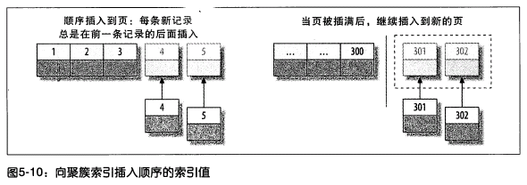

# 5. 创建高性能的索引

索引（Mysql中也叫“键”Key）是存储引擎用来快速找到记录的一种数据结构。索引对于良好的性能非常关键。尤其是表中的数据量越来越大时，索引对性能的影响愈发重要。因此，索引优化应该是查询性能优化最有效的手段了。

## 5.1 索引基础

索引的作用就像一本书的目录一样，存储引擎在索引中找到匹配的索引记录，进而找到对应的数据行。

### 5.1.1 索引的类型

Mysql中索引是在存储引擎层实现而不是服务器层的，所以不同存储引擎的索引工作方式并不一样，也不是所有存储引擎都支持所有类型的索引。

**B-Tree索引**

- **如果没有特别指明类型，多半说的是B-Tree索引**。
- 实际上很多存储引擎使用`B+Tree数据结构`存储数据：每个叶子节点都包含指向下一个叶子节点的指针，从而方便叶子节点的范围遍历。
- 存储引擎以不同的方式使用B-Tree索引。如：MyISAM使用`前缀压缩技术`使得索引更小，并通过`数据的物理位置引用`被索引的行，而InnoDB则根据`主键引用`被索引的行。NDB集群存储引擎实际使用T-Tree结构存储这种索引。
- B-Tree索引通常意味着所有的索引列值都是`按顺序存储`的，并且每个`叶子页`到根的距离相同（？！）。
  - B-Tree索引能够加快访问数据的速度，存储引擎不再需要进行全表扫描来获取需要的数据。
    - 取而代之的是从索引的根节点开始搜索。根节点的槽中存放了指向子节点的指针，存储引擎根据这些指针向下层查找。通过比较节点页的值和要查找的值可以找到合适的指针进入下层子节点。这些指针时间上定义了子节点页中的值的上限和下限。
    - `叶子节点`比较特别，指针指向的被索引的数据，而不是其他的节点页。
    - 实际在根节点和叶子节点之间可能有很多层节点页。树的深度和表的大小直接相关。
    - 请注意，索引对多个值进行排序的依据是CREATE TABLE语句中`定义索引时列的顺序`。


```mysql
-- 多列索引例子，后面用到。
CREATE TABLE People (
  last_name varchar(50) not null,
  first_name varchar(50) not null,
  dob date not null,
  gender enum('m','f') not null,
  key(last_name, first_name, dob)
)
```

- B-Tree索引适合于全键值、键值范围或键前缀查找。适合的查询类型如下：
  - `全值匹配`：索引中所有列进行精确匹配。如：查找姓名为Cuba Allen、出生于1960-01-01的人。
  - `匹配最左前缀`：使用索引的第一列、第一列+第二列 精确匹配。如：查找所有姓Allen的人、查找所有姓名为Cuba Allen的人。
  - `匹配列前缀`：使用索引的第一列匹配值的开头部分。如：查找所有以J开头的姓的人。
  - `匹配范围值`使用索引的第一列范围匹配。如：查找姓在Allen和Barry之间的人。
  - `精确匹配最左几列并范围匹配另外一列`。如：查找所有姓为Allen并且名是K开头的人、查找姓名为Cuba Allen并且1960年出生的人。
  - `只访问索引的查询（覆盖索引）`，即查询只需访问索引，而无须访问数据行。
- 一般来说，如果B-Tree可以按照某种方式查找到值，也可以按照这种方式来排序。所以，如果`ORDER BY子句`满足前面列出的集中查询类型，则这个索引也可以满足对应的排序需求。
- B-Tree索引的限制：
  - `如果不是按照索引的最左列开始查找，则无法使用索引`。如：无法查找名字叫Bill的人，也无法查找某个特定生日的人。
  - `不能跳过索引中的列`。如：无法查找姓Smith并且在某个特定日期出生的人。如果不指定名，则只能使用索引的第一列。
  - `如果查询中有某个列的范围查询，则其右边所有列都无法使用索引优化查找`。如：WHERE last_name='Smith' and first_name like 'J%' and dob='1976-12-23',该查询只能使用索引的前两列。（可以first_name查询数量有限，可以使用多个等于条件代替范围条件）
- 以上可见索引列的顺序多么重要。在优化性能时，可能需要使用相同的列但顺序不同的索引来满足不同类型的查询需求。


__以上很难理解，个人总结：复合索引的适用情景：__
- `精确匹配：全部索引列、第一列开始连续几列、第一列`
- `范围匹配：第一列`
- `匹配前缀：第一列`
- `组合：（第一列开始连续几列）精确匹配 + （下一列）范围匹配/匹配前缀`


**哈希索引**

- 哈希索引基于哈希表实现，`只有精确匹配索引所有列才有效`。
  - 存储引擎会对所有的索引列计算一个哈希码，并且不同键值行计算出来的哈希码是不一样的。
- Mysql中只有`Memory引擎显式`支持哈希索引，也是Memory引擎表的`默认`索引类型。（Memory引擎另外也支持B-Tree索引）。除Memory引擎外，NDB集群引擎也支持唯一哈希索引。
  - Memory引擎支持`非唯一`哈希索引（如果多个列的哈希值相同，索引会以链表的方式存放多个记录指针到同一个哈系条目中）

```mysql
-- 例子
CREATE TABLE testhash (
  fname varchar(50) not null,
  lname varchar(50) not null,
  key using HASH(fname)
) ENGINE=MEMORY;
```

- 哈希索引自身仅存储对应哈希值，结构十分紧凑，这让索引查找速度非常快。然而它也有限制：
  - 哈希索引只包含哈希值和行指针，并不存储字段值，所以`无法避免读取行`。
  - 哈希索引数据并不是按照索引列的值顺序存储的，所以也`无法用于排序`。
  - 不支持部分索引列匹配查找。如：列(A,B)上建立的哈希索引，索引无法只使用列A查询。
  - 只支持等值比较查询，包括`=,IN(),<=>(注意<>和<=>是不同的操作)`，也不支持任何范围查询。
  - 当出现`哈希冲突`（不同的索引值却有相同的哈希值）时，存储引擎必须遍历链表中所有的行指针，逐行比较直到找到。
    - 当哈希冲突很多的话，索引维护的代价也会很多。

哈希索引只适合某些特定的场合。如：数据仓库应用中一种典型的星型schema，需要关联很多查找表，就非常适合。

InnoDB引擎有一个特殊功能：“`自适应哈希索引` adaptive hash index”。当InnoDB注意到某些索引值被使用非常频繁时，会在内存中基于B-Tree索引之上再创建一个哈希索引，让B-Tree索引具备哈希索引的一些优点。这是一个完全自动、内部的行为，无法控制或配置，不过如有必要，完全可以关闭。

`自定义哈希索引`思路：在B-Tree的基础上创建一个伪哈希索引。还是使用B-Tree进行查找，但是它使用哈希值而不是键本身进行索引。这样只需要很小的索引就可以为超长的键创建索引。

```mysql
SELECT id FROM url WHERE url="http://www.mysql.com";

-- 删除url列原索引，新增一个被索引的url_crc列，使用CRC32做哈希
SELECT id FROM url WHERE url="http://www.mysql.com"
AND url_crc=CRC32("http://www.mysql.com");

-- 创建表，使用触发器自动维护哈希值
CREATE TABLE pseudohash (
  id int unsigned not null auto_increment,
  url varchar(255) not null,
  url_crc int unsigned not null default 0,
  primary key(id)
);

-- 临时修改语句分割符，这样可以在触发器定义中使用分号
DELIMITER //

CREATE TRIGGER pseudohash_crc_ins BEFORE INSERT ON pseudohash FOR EACH ROW BEGIN
SET NEW.url_crc=crc32(NEW.url);
END;
//

CREATE TRIGGER pseudohash_crc_upd BEFORE UPDATE ON pseudohash FOR EACH ROW BEGIN
SET NEW.url_crc=crc32(NEW.url);
END;
//

DELIMITER ;

-- SHA1()和MD5()属于强加密函数，设计目标是最大限度消除冲突，这里并没有这样高的要求
-- 简单函数的冲突在一个可以接受的范围内，同时又提供更好的性能
-- 如果数据表非常大，CRC32()会出现大量哈希冲突，可以考虑自己实现一个简单的64位哈希函数
SELECT CONV(RIGHT(MD5('http://www.mysql.com/'),16),16,10) as HASH64;

-- CRC32()返回的是32位整数，当索引有93000条记录时出现冲突的概率是1%。
-- 要避免冲突，必须在WHERE条件中带入哈希值和对应列的值。
SELECT word,crc FROM words WHERE crc=CRC32('gnu') AND word='gnu';

-- 可以考虑使用FNV64()作为哈希函数，移植自Percona Server的插件
-- 哈希值为64位，速度快，且冲突比CRC32()要少很多。
```

**其他索引**

- 空间数据索引： 
  - MyIsAM支持空间索引，用来存储地理数据。（并不完善）
    - 无需前缀查询，可以使用任意维度来组合查询。
    - 必须使用Mysql的 GIS相关函数来维护数据。
  - 开源关系数据库中GIS解决方案比较好的是 PostgreSQL的`PostGIS`
- `全文索引`：一种特殊的索引，主要查找文本中的关键字，而不是直接比较索引值。全文检索跟其他索引匹配使用方式完全不同，有很多需要注意的细节：停用词、词干和复数、布尔搜索等。它更类似搜索引擎。
- 第三方索引：TokuDB使用分形树索引

## 5.2 索引的优点

索引不仅仅可以让服务器快速定位到表的指定位置，总结有如下三个优点：
- 大大减小了服务器需要扫描的数据量
- 可以帮助服务器避免排序和临时表
- 可以将随机IO变成顺序IO

Lahdenmaki和Leach在《Relational Database Index Design and the Optimizers》提到：
评价索引是否适合某个查询的 __“三星系统”__：
1. `索引将相关的记录放到一起则获得一星；`
2. `索引中的数据顺序和查找中的排序顺序一致则获得二星；`
3. `索引中的列包含了查询中需要的全部列则获得三星；`

只有当索引索引帮助存储引擎快速查找到记录带来的好处大于其带来的额外工作时，索引才是有效的。
- 对于非常小的表，大部分情况下简单的全表扫描更高效
- 对于中大型表，索引就比较有效
- 对于特大型表，建立和使用索引的代价将随之增长。这时需要一种技术可以直接区分出查询需要的一组数据，而不是一条记录一条记录地匹配。如：`分区技术`
- 如果表的数量特别多，可以建立一个元数据信息表，用来查询需要用到的某些特征。如：执行那些需要聚合多个应用分布在多个表的数据的查询，则需要记录“哪个用户的信息存储在哪个表中”的元数据。
- 对于大型系统，TB级别的数据，定位单条记录意义不大，所以经常会使用块`级别元数据技术`代替索引。Infobright就是类似实现。

## 5.3 高性能的索引策略

### 5.3.1 独立的列

独立的列指：索引列不能是表达式的一部分，也不能是函数的参数

```mysql
-- 不能使用actor_id列的索引。
SELECT actor_id FROM sakila.actor WHERE actor_id + 1 = 5;

-- 另一个错误
SELECT ... WHERE TO_DAYS(CURRENT_DATE) - TO_DAYS(date_col) <= 10;
```

### 5.3.2 前缀索引和索引选择性

有时候需要索引很长的字符串，这会让索引变得大又慢。一个策略是前面提到的模拟哈希索引。除此之外呢？通常可以索引开始的部分字符，这样可以大大节约索引空间，从而提高索引效率。但这样也会降低索引的选择性。

`索引的选择性`是指，不重复的索引值（也称为基数 cardinaality）和数据表的记录总数（#T）的比值，范围从1/#T到1之间。索引的选择性越高则查询效率越高，因为选择性高的索引可以让Mysql查找时过滤掉更多的行。唯一索引选择性是1,也是最好的。

- 对于BLOB，TEXT或很长的VARCHAR类型的列，必须使用前缀索引，因为Mysql不允许索引这些列的完整长度。
- 诀窍在于选择足够长的前缀以保证较高的选择性，同时不能太长（以便节约空间）。`换言之，前缀的基数应该接近于完整列的基数。`
  - 决定前缀的合适长度方法：
    - 需要找到`最常见的值`的`出现次数`列表，然后和最常见的前缀列表比较。
    - 另一个方法是：计算完整列的选择性，并使前缀的选择性接近于完整列的选择性。
  
```mysql
-- 决定前缀长度方法1：比较前缀长度谁更接近最常见值出现次数
select count(*) as cnt, city
from sakila.city_demo group by city order by cnt desc limit 10;

select count(*) as cnt, LEFT(city,3) as pref
from sakila.city_demo group by pref order by cnt desc limit 10;

select count(*) as cnt, LEFT(city,7) as pref
from sakila.city_demo group by pref order by cnt desc limit 10;

-- 决定前缀长度方法2：比较前缀长度谁更接近完整列选择性
select count(distinct city)/count(*) from sakila.city_demo;

select count(distinct left(city,3))/count(*) as sel3,
count(distinct left(city,4))/count(*) as sel4,
count(distinct left(city,5))/count(*) as sel5,
count(distinct left(city,6))/count(*) as sel6,
count(distinct left(city,7))/count(*) as sel7
from sakila.city_demo;

-- 演示创建前缀索引
ALTER TABLE sakila.city_demo ADD KEY(city(7));
```

- 缺点：无法使用前缀索引做ORDER BY和GROUP BY，也无法做覆盖扫描。
- 一个常见场景：针对很长的十六进制唯一ID（如网站SESSION）使用前缀索引。
- 后缀索引的变通：字符串反转后储存，并基于此建立前缀索引。

### 5.3.3 多列索引

- `在多个列上建立独立的单列索引在大部分情况下并不能提高Mysql的查询性能`。
  - 有时“把Where条件里面的列都建上索引”，不如忽略掉where子句，集中精力优化索引列的顺序，或者创建一个全覆盖索引。
  - Mysql5.0以上版本引入“`索引合并`index merge”策略，一定程度可以使用表上的多个单列索引定位指定的行。
    - 查询能够同时使用多个单列索引进行扫描，并将结果进行合并。这种算法有三个变种：`OR条件的联合union, AND条件的相交intersection,组合前两种情况的联合及相交`。
    - 索引合并策略有时候是一种优化，但实际更多说明了表上的索引建的很糟糕！遇到索引合并，最好检查一下！
      - 多个索引相交操作（多个AND条件）时，通常意外着需要一个包含所有相关列的多列索引，而不是多个独立单列索引。
      - 多个索引联合操作（多个OR条件）时，通常需要耗费大量CPU和内存资源在算法的缓存、排序和合并操作上。特别是某些索引的选择性并不高，需要合并扫描返回大量数据时。
        - 更重要的是，优化器不会把这些计算到“查询成本cost”上，优化器只关心随机页面读取。这会使查询成本被低估，导致该执行计划还不如全表扫描。消耗更多CPU和内存资源后，可能会影响查询的并发性。
      - 可以通过参数`optimizer_switch`关闭，或使用`IGNORE INDEX`提示优化器忽略某些索引。

```mysql
-- 使用2个单列索引并不是好的选择
SELECT film_id,actor_id FROM sakila.file_actor WHERE actor_id=1 OR film_id=1;

-- 通过 UNION 变通优化
SELECT film_id,actor_id FROM sakila.file_actor WHERE actor_id=1 
UNION ALL
SELECT film_id,actor_id FROM sakila.file_actor WHERE film_id=1
AND actor_id<>1;

-- EXPLAIN 索引合并
explain select * from sakila.film_actor where actor_id=1 or film_id=1 \G
*************************** 1. row ***************************
           id: 1
  select_type: SIMPLE
        table: film_actor
   partitions: NULL
         type: index_merge
possible_keys: PRIMARY,idx_fk_film_id
          key: PRIMARY,idx_fk_film_id
      key_len: 2,2
          ref: NULL
         rows: 29
     filtered: 100.00
        Extra: Using union(PRIMARY,idx_fk_film_id); Using where
1 row in set, 1 warning (0.00 sec)
```

### 5.3.4 选择合适的索引列顺序

- 正确的顺序依赖`使用该索引的查询`，并且同时需要考虑如何更好地`满足排序和分组`的需要。
- 适用于B-Tree索引，哈希或其他索引并不能像B-Tree一样按顺序存储数据。
- 有一个经验法则：`将选择性最高的列放到索引最前列`。这个建议有用吗？在某些场景可能有帮助，但通常不如`避免随机IO和排序`那么重要。
  - 当不需要考虑排序和分组时，将选择性最高的列放前面通常是很好的。
    - 性能不只是依赖于所有索引列的选择性，也和`值的分布`有关。这和前面介绍选择前缀长度需要考虑的地方一样。可能需要根据那些运行频率最高的查询来调整索引列的顺序。
      - 需要注意，查询的结果非常依赖查询条件的`具体值`！某些查询的运行会不如预期。
  
```mysql
-- 如何判断要创建的(staff_id,customer_id)索引的列是否需要颠倒一下顺序？
select * from payment where staff_id=2 and customer_id=584;

-- 依据具体的查询，或通过诸如pt-query-digest等工具报告中提取“最差”查询
select sum(staff_id=2),sum(customer_id=584) from payment;

-- 或者按经验法则，考虑全局基数和选择性，而不是具体查询
select count(distinct staff_id)/count(*) as staff_id_selectivity,
count(distinct customer_id)/count(*) as customer_id_selectivity,
count(*) from payment;
```

### 5.3.5 聚簇索引

聚簇索引并不是一种单独的索引类型，而是一种数据存储方式。在oracle中又叫“索引组织表 index-organized table”。“聚簇”表示数据行和相邻的键值总是紧凑地存储在一起。
- 在InnoDB中实际在聚簇索引中保持了B-Tree索引和数据行。
  - 数据行存放在索引的叶子页leaf page中。
- 无法同时把数据行存放在两个不同的地方（每个表只能用一个聚簇索引，即就是主键）
  - 如果没有定义主键，InnoDB会选择一个唯一的非空索引代替。如果没有这样的索引，InnoDB会隐士定义一个主键来作为聚簇索引。

优点：
- 可以把相关数据保存在一起。
- 数据访问更快。
- 使用覆盖索引扫描的查询可以直接使用页节点中的主键值。
缺点：
- 聚簇索引最大限制提供了IO密集型应用的性能，但如果数据全部放在内存中，则访问的数据就没有那么重要了。
- 插入速度严重依赖于插入的顺序。按照主键顺序插入是速度最快的方式。但如果不是按主键顺序加载数据，最好加载完成后使用OPTIMIZE TABLE重新组织一下表。
- 更新聚簇索引列的代价很高，因为会强制被更新的行移动位置。
- 插入新行或更新聚簇索引列时可能面临`“页分裂page split”`问题。（当主键值觉得必须插入到某个已满的页中时，存储引擎会将页分裂成两个页面来容纳该行）
- 可能导致全表扫描变慢，尤其是`行比较稀疏`，或者页分裂导致数据存储不连续时。
- `二级索引（非聚簇索引）`可能比想象的要更大，因为二级索引的叶子节点包含了引用行的主键列。
- 二级索引访问需要两次索引查找，而不是一次。（二级索引叶子节点保存的不是指向行的物理位置的指针，而是行的主键值）
  - 对于InnoDB来说，自适应哈希索引可以减少这样的重复工作。

**InnoDB 和 MyISAM 的数据分布对比:**
- MyISAM按照数据`插入的顺序`存储在磁盘上。索引按`索引列的值排序`，并存储指向行的指针。（主键索引和其他索引在结构上没什么不同）
- InnoDB的`聚簇索引就是表`，不像MyISAM那样是独立的行存储。
  - 聚簇索引每个叶子节点包含了主键值、事务ID、MVCC的回滚指针以及剩余的列。
  - 二级索引和聚簇索引也不相同，它的叶子节点`存储的不是行指针，而是主键值`。（此策略减少了当行移动或页分裂时二级索引的维护工作）

```mysql
create table layout_test (
  col1 int not null,
  col2 int not null,
  primary key(col1),
  key(col2)
)
```


**在InnoDB表中按主键顺序插入行：**
- 如果没有什么数据需要聚集，可以默认`AUTO_INCREMENT`自增列。
- 最好避免随机（`不连续且值的分布范围非常大`）的聚簇索引，特别是IO密集型应用，使用UUID做聚簇索引会非常糟糕（这让索引插入变得完全随机，没有任何聚集特征）。
- 对于高并发工作，顺序的主键插入可能造成明显的争用。主键的上界会变成`“焦点”`。另一个热点是AUTO_INCREMENT索机制。
  - 可以考虑重新设计表，或者更改`innodb_autoinc_lock_mode`参数。




### 5.3.6 覆盖索引

覆盖索引：一个索引包含（或者覆盖）所有需要查询的字段的值。使用索引可以直接获取列的数据，这样就不再需要读取数据行了。

能够极大地提高性能： 
- 索引条目永远小于数据行，所以极大地`减小了数据访问量`，对缓存负载也很重要，因为响应时间大部分花费在数据拷贝上。对IO密集型应用也有帮助，因为`更容易放入内存中`。(MyISAM利用压缩索引可以变得更小)
- 索引是按列值顺序存储的，所以`IO密集型的范围查询`比随机磁盘读取的IO要少很多。（对于MyISAM和Percona XtraDB可以通过`OPTIMIZE`命令使索引完全顺序排列，这让简单的范围查询能使用`完全的顺序的索引访问`）
- `MyISAM在内存中缓存索引`，数据则依赖操作系统来缓存，因此访问数据需要一次系统调用。这可能导致严重的性能问题。
- 由于InnoDB的聚簇索引，覆盖索引对InnoDB特别有用。如果`二级索引`能够覆盖查询，则可以避免对主键索引的二次查询。

局限：
- 只能使用B-Tree索引做覆盖索引，而哈希索引、空间索引、全文索引等不可以（不能存储索引列的值）。
- Memory引擎不支持。

```mysql
-- 覆盖索引在EXPLAIN 的Extra 列中可以看到“Using index”
-- 解释：EXPLAIN的type列，称为连接方式(join type)，它显示的"index"代表查询访问数据的方式，跟覆盖索引无关！
explain select store_id,film_id from sakila.inventory \G
*************************** 1. row ***************************
           id: 1
  select_type: SIMPLE
        table: inventory
   partitions: NULL
         type: index
possible_keys: NULL
          key: idx_store_id_film_id
      key_len: 3
          ref: NULL
         rows: 4581
     filtered: 100.00
        Extra: Using index
1 row in set, 1 warning (0.00 sec)
```

```mysql
-- 一个无法使用覆盖索引的例子：
-- 解释：1.不能在索引中执行LIKE，2.索引不能覆盖查询
select * from products where actor='SEAN CARREY' and title like '%POLLO%';

-- 优化办法：通过延迟关联，延迟对列的访问。
select * from products joins(
  select prod_id from products
  where actor='SEAN CARREY' and title like '%POLLO%'
) as t1 on (t1.prod_id=products.prod_id);

-- InnoDB的二级索引的叶子节点中都包含主键的值，因为可以有效利用“额外”的主键来覆盖查询。
EXPLAIN select actor_id, last_name
from sakila.actor where last_name='HOPPER';
```

### 5.3.7 使用索引扫描来做排序

Mysql有两种方式可以生产有序的结果：`通过排序操作；或者按照索引顺序扫描`；
  - EXPLAIN出来的type列的值如果是“index”，则说明mysql使用了索引扫描来排序。
  - 扫描索引本身很快，只需要从一条索引记录移动到下一条记录。但如果索引不能覆盖查询所需要的全部列，那就不得不每扫描一条索引记录就都回表查询一次对应的行。这样基本都是随机IO，因此，`按索引顺序读取数据的速度通常要比顺序地全表扫描慢。`
    - 设计索引应该尽可能同时既满足排序又用于查找行。

什么情况才能使用索引对结果排序：
  - 只有当索引列的顺序和ORDER BY子句的顺序完全一致，并且所有列的排序方向（倒序或正序）都一样。
  - 如果查询多个关联表，只有当ORDER BY子句引用的字段全部为第一个表时。
  - ORDER BY子语句和查找的限制是一样的：满足索引的最左前缀要求。
    - 如果WHERE子句或JOIN子句对前导列指定了常量，也可以弥补索引的不足。

```mysql
-- 使用索引(rental_date,inventory_id,customer_id)顺序排序；
EXPLAIN select rental_id,staff_id from sakila.rental
where rental_date='2005-05-25'
order by inventory_id, customer_id;

-- 可以使用索引顺序排序。
... where rental_date='2005-05-25' order by inventory_id;

-- 不可以使用索引顺序排序。
... where rental_date='2005-05-25' order by inventory_id DESC, customer_id ASC;
... where rental_date='2005-05-25' order by inventory_id, staff_id;
... where rental_date='2005-05-25' order by customer_id;
... where rental_date>'2005-05-25' order by inventory_id, customer_id;
... where rental_date>'2005-05-25' and inventory_id in(1,2) order by customer_id;
select actor_id,title from sakila.film_actor 
inner join sakila.film using(film_id) order by actor_id;
```

### 5.3.8 压缩（前缀压缩）索引

`MyISAM 使用前缀压缩来减少索引的大小，从而让更多的索引可以放入内存中。`这在某些情况极大地提高性能。
- 默认`只压缩字符串`，也可通过参数设置对整数压缩。
- 压缩索引块的办法：`先保存索引块的第一个值，然后将其他值和第一个值进行比较得到相同前缀和剩余的不同后缀部分`，把这部分存储起来即可。
  - 如：索引块第一个值是“perform”，第二个值是“performance”，那么第二个值存储类似“7,ance”这样的形式。
- 代价是某些操作可能更慢，因为压缩前缀都依赖前面的值，所以查找索引时无法使用二分查找而只能从头扫描。如：`倒序扫描`
- 选择压缩索引需要`在CPU内存资源和磁盘之间做权衡`：
  - 对于CPU密集型应用，因为扫描需要随机查找，压缩索引使得索引查找要慢好几倍。倒序扫描就更慢了。
  - 可能压缩索引只需要十分之一大小的磁盘，如果是IO密集应用，对某些查询带来的好处会比多本多很多。
- 可以在CREATE TABLE语句制定`PACK_KEYS`参数控制索引压缩的方式。

### 5.3.9 冗余和重复索引

mysql允许在相同列上创建多个索引，单独维护重复的索引，并且优化器在优化查询时也需要逐个进行考虑，这会影响性能。

`重复索引`：在相同的列上按照相同的顺序创建的相同类型的索引。应避免！

```mysql
-- Mysql的唯一限制和主键限制都是通过索引实现的，因此创建了三个重复的索引！
create table test(
  id int not null primary key,
  a int not null,
  b int not null,
  unique(id),
  index(id)
) engine=InnoDB;
```

`冗余索引`：对于B-Tree索引来说，一个索引是另一个索引的前缀索引。
  - 如： 创建了索引(A,B)，再创建索引(A)就是冗余的，而创建索引(B,A)或索引(B)则不是冗余的。另外，其他类型索引如哈希索引、全文索引也不是B-Tree索引的冗余索引。
  - 冗余索引经常发生在为表添加新索引时。
    - 如：增加新索引(A,B)，而不是扩展已有的索引(A)；
    - 如：扩展已有的索引(A)为`(A,ID)`。ID是InnoDB的主键，原二级索引(A)已经包含了主键列了。
  - 大部分情况都`不需要`冗余索引，应该尽量扩展已有索引而不是创建新索引。
  - 但有时出于性能考虑`需要`冗余索引。但同时因为扩展已有索引会导致其变的很大，从而影响其他使用该索引的查询的性能。
    - 冗余索引的缺点是成本更高。将会导致INSERT、UPDATE、DELETE等操作速度变慢，特别是达到内存瓶颈的时候。

```mysql
-- Q1: 索引(state_id)有利；
select count(*) from userinfo where state_id=5;
-- Q2: 索引(state_id,city,address)有利；
select state_id,city,address from userinfo where state_id=5;
```


查找冗余和重复索引：
- 写查询访问 INFORMATION_SCHEMA表
- 使用工具 common_schema、Percona Toolkit的 pt-duplicate-key-checker 等检查

### 5.3.10 未使用的索引

有的索引只是为了唯一约束，可能永远被服务器使用，建议删除。查找无用索引：
- 在Percona Server或 MariaDB中打开userstate变量，让服务器运行一段时间后，通过查询INFORMATION_SCHEMA.INDEX_STATISTICS查看每个索引的使用频率。
- 使用工具 Percona Toolkit的 pt-index-usage

### 5.3.11 索引和锁
## 5.4 索引案例学习
### 5.4.1 支持多种过滤条件
### 5.4.2 避免多个范围条件
### 5.4.3 优化排序
## 5.5 维护索引和表
### 5.5.1 找到并修复损坏的表
### 5.5.1 更新索引统计信息
### 5.5.1 减少索引和数据的碎片

